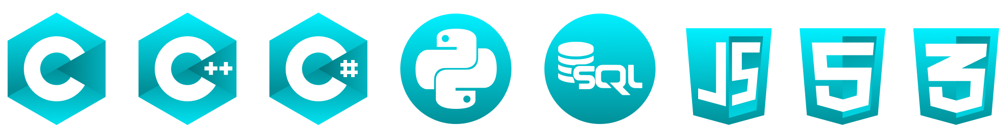
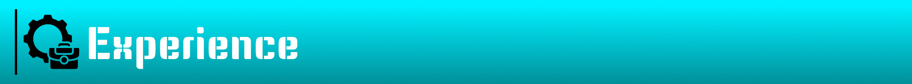

<h1>Hi 👋, I am <a href="https://www.linkedin.com/in/dmitrii-semenov-885464293/" target="_blank">Dmitrii Semenov</a></h1>
<h2>Check out my website → <a href="https://dmitrii-semenov.vercel.app/" target="_blank">here!</a></h2> 

AI enthusiast & full-stack developer with a passion for building smart, end-to-end applications that solve real-world problems.

I’ve developed AI-powered apps from the ground up — like <strong>Nutrisha</strong>, an AI nutritionist, that uses FHIR patients’ health data to generate personalized diet plans and analyze meal images, and <strong>FoodFighters</strong>, an AI gamified app, that transforms nutrition from a chore into a game, making healthy eating accessible, engaging, and community-driven.

My journey started in Russia, where I won the national Big Change 2021 competition and became a WorldSkills finalist in Software Solutions for Business, receiving a $20,000 award. Since then, I’ve built desktop, web, and mobile apps with modern stacks like React, Node.js, TypeScript, Python, MongoDB and more.

After completing the Computer Programming program at Seneca Polytechnic, I’m now actively seeking full-time software engineering roles—especially where I can keep building powerful, human-centered AI solutions.

Let’s make tech easier, better, faster.

   

   

<article>
      <h3>Computer Programming at Seneca Polytechnic College (09/2023 – 04/2025)</h3>
      
Relevant courses: OOP Development Using C++, Software Testing, Web Programming.

      
GPA: 4.0 / 4.0

</article>
<article>
      <h3>IT & Programming at Moscow State Technology College (09/2018 – 06/2022)</h3>
      
Relevant courses: Software Development Tools, Management and Automation of Databases, Mathematical Modelling.

      
GPA: Excellent (equivalent to 4.0)

</article>
   

<article>
  <h3>Full-Stack Software Developer - Empowered Futures (03/2025 – Current)</h3>
      <ul>
          <li>Developed and maintained full-stack applications with JavaScript / TypeScript, Node.js, ReactJS and Tailwind, serving 1K+ monthly users with 99.9% uptime.</li>
          <li>Designed and implemented GraphQL APIs to streamline frontend interactions, reducing data-fetching time by 40%.</li>
          <li>Led code reviews and performance optimizations, decreasing bug reports by 30% and improving release stability across sprints.</li>
      </ul>
</article>
<article>
  <h3>Software Developer Internship - Health Samurai (04/2024 – 08/2024)</h3>
      <ul>
          <li>Tested OAuth 2.0 API requests, including authorization flows, token handling, JWT authentication, and more, ensuring robust security and functionality.</li>
          <li>Contributed to the SQL on FHIR JavaScript reference implementation, focusing on testing features and resolving critical date formatting issues to enhance healthcare data accessibility.</li>
          <li>Participated in weekly meetings with internal and external developers to discuss SQL on FHIR project progress, roadblocks, and solutions.</li>
      </ul>
</article>
<article>
  <h3>Software Developer Intern - Unlim Group LLC (05/2022 – 09/2022)</h3>
      <ul>
          <li>Designed and implemented an SQLite database following 3NF principles, resulting in a remarkable 20% performance boost.</li>
          <li>Developed a mobile app interface inspired by HeadHunter using Xamarin, boosting user retention by 15%.</li>
          <li>Actively contributed to discussions about API architecture and design for optimal performance.</li>
      </ul>
</article>
<article>
  <h3>Software Developer Intern - Kont Group of Companies (08/2020 – 12/2020)</h3>
      <ul>
          <li>Designed customer-centric UX/UI prototypes in Figma and developed desktop applications using ADO.NET Entity Framework.</li>
          <li>Implemented server-side image storage, enhancing user experience.</li>
          <li>Engineered an application leading to an 80% reduction in order creation and documentation time.</li>
      </ul>
</article>

<!--
**Diferti/Diferti** is a ✨ _special_ ✨ repository because its `README.md` (this file) appears on your GitHub profile.

Here are some ideas to get you started:

- 🔭 I’m currently working on ...
- 🌱 I’m currently learning ...
- 👯 I’m looking to collaborate on ...
- 🤔 I’m looking for help with ...
- 💬 Ask me about ...
- 📫 How to reach me: ...
- 😄 Pronouns: ...
- ⚡ Fun fact: ...
-->
